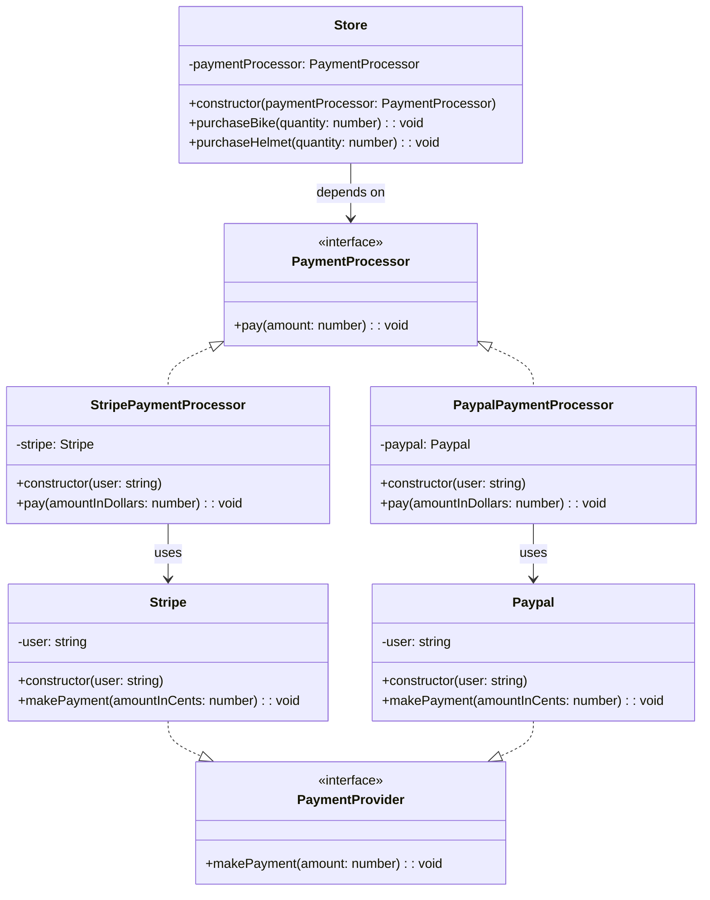

```mermaid
classDiagram

    class PaymentProvider {
      <<interface>>
      +makePayment(amount: number): void
    }

    class Stripe {
      -user: string
      +constructor(user: string)
      +makePayment(amountInCents: number): void
    }

    class Paypal {
      -user: string
      +constructor(user: string)
      +makePayment(amountInCents: number): void
    }

    class PaymentProcessor {
      <<interface>>
      +pay(amount: number): void
    }

    class Store {
      -paymentProcessor: PaymentProcessor
      +constructor(paymentProcessor: PaymentProcessor)
      +purchaseBike(quantity: number): void
      +purchaseHelmet(quantity: number): void
    }

    class StripePaymentProcessor {
      -stripe: Stripe
      +constructor(user: string)
      +pay(amountInDollars: number): void
    }

    class PaypalPaymentProcessor {
      -paypal: Paypal
      +constructor(user: string)
      +pay(amountInDollars: number): void
    }


    PaymentProcessor <|.. StripePaymentProcessor
    PaymentProcessor <|.. PaypalPaymentProcessor
    StripePaymentProcessor --> Stripe : uses
    PaypalPaymentProcessor --> Paypal : uses
    Stripe ..|> PaymentProvider
    Paypal ..|> PaymentProvider
    Store --> PaymentProcessor : depends on

```