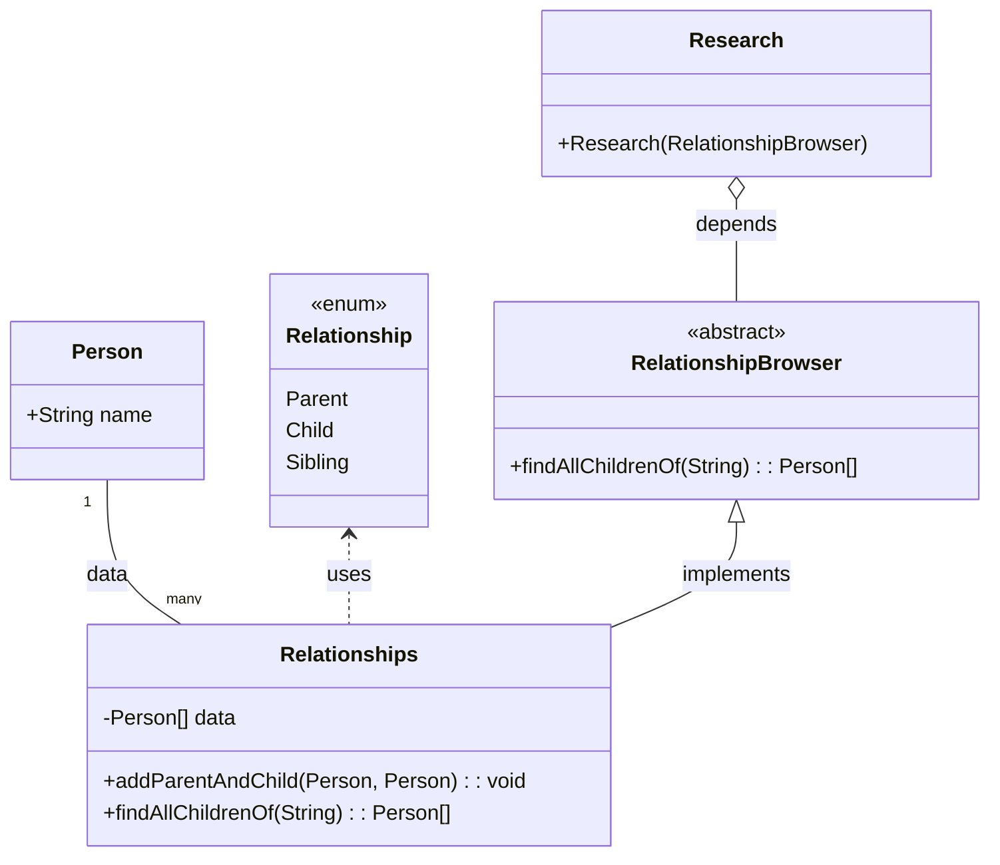

## DIP: Dependency Inversion Principle

-   program to an interface, not an implementation
-   abstractions should not depend on details, details should depend on abstractions
-   interface abstractions are more stable (change less frequently) than concrete implementations
-   GOF Factory pattern shlud be used to keep concrete implementation out of business logic
-   use a small number of concrete "main" components, where all DIP violations are gathered
-   high-level modules should not depend on ,low level module, but should depend on abstractions

## IoC and DI

-   While not explicitly named in the GoF design patterns, IoC and DI align with the principles of good design the GoF patterns aim to achieve, such as promoting loose coupling and enhancing modularity.
-   These concepts are more closely related to architectural patterns and principles that guide the overall structure and organization of software systems, rather than the specific design patterns that address more localized problems in software design.

